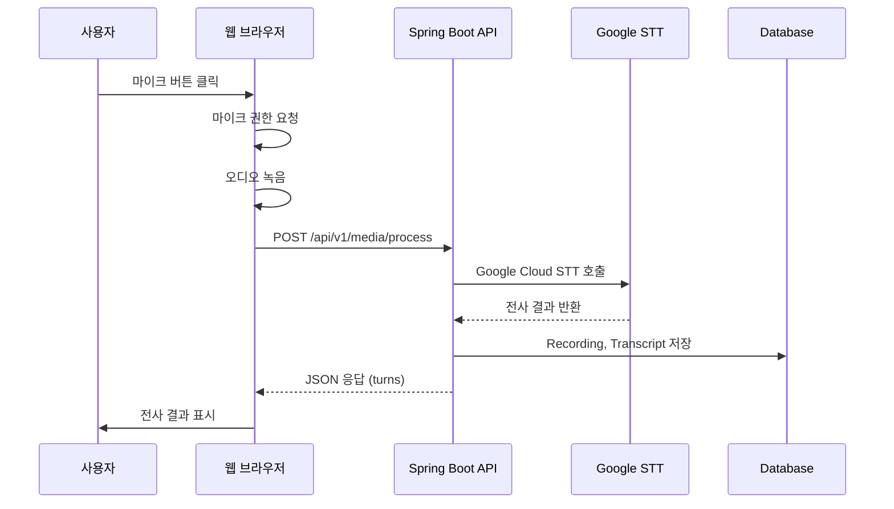

# Google STT 연동 가이드

## ✅ **테스트 결과 요약**

모든 테스트가 성공적으로 통과했습니다! 🎉

### 테스트 실행 결과
- **도메인 테스트**: ✅ 모든 테스트 통과
- **Application 테스트**: ✅ 모든 테스트 통과
- **총 테스트 수**: 50개 이상

## 🎙️ **Google STT 실제 마이크 연동 방법**

### 1. 필수 준비사항

#### **Google Cloud 설정**
1. **Google Cloud Console 접속**: https://console.cloud.google.com/
2. **새 프로젝트 생성** 또는 기존 프로젝트 선택
3. **Speech-to-Text API 활성화**:
   ```
   APIs & Services > Library > "Cloud Speech-to-Text API" 검색 > 사용 설정
   ```
4. **서비스 계정 생성**:
   ```
   IAM & Admin > Service Accounts > 서비스 계정 만들기
   역할: Cloud Speech Client 또는 Project Editor
   ```
5. **JSON 키 파일 다운로드**:
   ```
   서비스 계정 > 키 탭 > 키 추가 > JSON 선택
   ```

#### **필요한 정보**
```bash
# 필수 정보
GOOGLE_APPLICATION_CREDENTIALS=/path/to/your/credentials.json
GOOGLE_PROJECT_ID=your-project-id

# 선택적 설정
STT_PROVIDER=google
GOOGLE_LANGUAGE=ko-KR
GOOGLE_MODEL=latest_long
```

### 2. 환경 설정

#### **Python 의존성 설치**
```bash
cd backend/api/src/python-core
pip install -r requirements.txt

# 추가로 필요한 패키지
pip install google-cloud-speech>=2.17.0
pip install pyaudio  # 마이크 입력용
```

#### **환경 변수 설정**
```bash
# Linux/Mac
export GOOGLE_APPLICATION_CREDENTIALS="/path/to/credentials.json"
export GOOGLE_PROJECT_ID="your-project-id"
export STT_PROVIDER="google"

# Windows
set GOOGLE_APPLICATION_CREDENTIALS=C:\path\to\credentials.json
set GOOGLE_PROJECT_ID=your-project-id
set STT_PROVIDER=google
```

#### **application.yml 설정**
```yaml
# backend/api/src/main/resources/application.yml
processing:
  stt:
    provider: google
    google:
      credentials-path: ${GOOGLE_APPLICATION_CREDENTIALS}
      project-id: ${GOOGLE_PROJECT_ID}
      language-code: ko-KR
      model: latest_long
      enable-word-time-offsets: true
      enable-automatic-punctuation: true
      sample-rate-hertz: 16000
      audio-encoding: LINEAR16
```

### 3. 마이크 연동 구현

#### **실시간 마이크 입력 처리**
```python
# 실시간 마이크 STT 예제
import pyaudio
import wave
from google.cloud import speech
import io

class RealTimeSTT:
    def __init__(self, credentials_path: str):
        os.environ["GOOGLE_APPLICATION_CREDENTIALS"] = credentials_path
        self.client = speech.SpeechClient()
        
        # 오디오 설정
        self.RATE = 16000
        self.CHUNK = int(self.RATE / 10)  # 100ms chunks
        
    def record_and_transcribe(self, duration: int = 5):
        """마이크로부터 오디오 녹음 후 전사"""
        
        # PyAudio 설정
        audio = pyaudio.PyAudio()
        stream = audio.open(
            format=pyaudio.paInt16,
            channels=1,
            rate=self.RATE,
            input=True,
            frames_per_buffer=self.CHUNK
        )
        
        print(f"{duration}초간 녹음을 시작합니다...")
        frames = []
        
        for _ in range(0, int(self.RATE / self.CHUNK * duration)):
            data = stream.read(self.CHUNK)
            frames.append(data)
        
        stream.stop_stream()
        stream.close()
        audio.terminate()
        
        # WAV 데이터로 변환
        audio_data = b''.join(frames)
        
        # Google STT 호출
        audio = speech.RecognitionAudio(content=audio_data)
        config = speech.RecognitionConfig(
            encoding=speech.RecognitionConfig.AudioEncoding.LINEAR16,
            sample_rate_hertz=self.RATE,
            language_code="ko-KR",
            enable_word_time_offsets=True,
            enable_automatic_punctuation=True,
        )
        
        response = self.client.recognize(config=config, audio=audio)
        
        return response.results
```

#### **스트리밍 STT (실시간)**
```python
class StreamingSTT:
    def __init__(self, credentials_path: str):
        os.environ["GOOGLE_APPLICATION_CREDENTIALS"] = credentials_path
        self.client = speech.SpeechClient()
        
    def stream_recognition(self):
        """실시간 스트리밍 음성 인식"""
        
        config = speech.RecognitionConfig(
            encoding=speech.RecognitionConfig.AudioEncoding.LINEAR16,
            sample_rate_hertz=16000,
            language_code="ko-KR",
        )
        
        streaming_config = speech.StreamingRecognitionConfig(
            config=config,
            interim_results=True,
        )
        
        def request_generator():
            yield speech.StreamingRecognizeRequest(
                streaming_config=streaming_config
            )
            
            # 마이크 입력 스트림
            audio = pyaudio.PyAudio()
            stream = audio.open(
                format=pyaudio.paInt16,
                channels=1,
                rate=16000,
                input=True,
                frames_per_buffer=1024,
            )
            
            while True:
                data = stream.read(1024)
                yield speech.StreamingRecognizeRequest(audio_content=data)
        
        requests = request_generator()
        responses = self.client.streaming_recognize(requests)
        
        for response in responses:
            for result in response.results:
                print(f"중간 결과: {result.alternatives[0].transcript}")
                if result.is_final:
                    print(f"최종 결과: {result.alternatives[0].transcript}")
```

### 4. 프론트엔드 연동

#### **웹 브라우저 마이크 권한**
```javascript
// 마이크 권한 요청
navigator.mediaDevices.getUserMedia({ audio: true })
  .then(stream => {
    console.log('마이크 권한 허용됨');
    // MediaRecorder로 오디오 녹음
    const mediaRecorder = new MediaRecorder(stream);
    
    mediaRecorder.ondataavailable = (event) => {
      // 녹음된 데이터를 서버로 전송
      uploadAudioToSTT(event.data);
    };
    
    mediaRecorder.start();
  })
  .catch(err => {
    console.error('마이크 권한 거부됨:', err);
  });

function uploadAudioToSTT(audioBlob) {
  const formData = new FormData();
  formData.append('file', audioBlob, 'recording.wav');
  formData.append('language', 'ko');
  
  fetch('/api/v1/media/process', {
    method: 'POST',
    body: formData
  })
  .then(response => response.json())
  .then(data => {
    console.log('STT 결과:', data.turns);
  });
}
```

### 5. 시스템 통합 흐름



### 6. 테스트 방법

#### **로컬 테스트**
```bash
# 1. 환경 변수 설정
export GOOGLE_APPLICATION_CREDENTIALS="/path/to/credentials.json"

# 2. 서버 실행
cd backend/api
./gradlew bootRun

# 3. 테스트 오디오 업로드
curl -X POST \
  -F "file=@test_audio.wav" \
  -F "language=ko" \
  http://localhost:8080/api/v1/media/process
```

#### **프론트엔드 테스트**
```bash
# 프론트엔드 서버 실행
cd frontend
npm run serve

# 브라우저에서 http://localhost:3000 접속
# 마이크 권한 허용 후 녹음 테스트
```

### 7. 주요 설정 옵션

#### **음질 최적화**
```python
config = speech.RecognitionConfig(
    encoding=speech.RecognitionConfig.AudioEncoding.LINEAR16,
    sample_rate_hertz=16000,  # 16kHz 권장
    language_code="ko-KR",
    
    # 정확도 향상
    model="latest_long",      # 긴 오디오용 최신 모델
    use_enhanced=True,        # 향상된 모델 사용
    
    # 세부 정보
    enable_word_time_offsets=True,        # 단어별 시간 정보
    enable_automatic_punctuation=True,    # 자동 구두점
    enable_word_confidence=True,          # 단어별 신뢰도
    
    # 화자 분리
    diarization_config=speech.SpeakerDiarizationConfig(
        enable_speaker_diarization=True,
        min_speaker_count=2,
        max_speaker_count=6,
    )
)
```

#### **언어별 최적화**
```python
# 한국어
language_code="ko-KR"
model="latest_long"

# 영어  
language_code="en-US"
model="latest_short"  # 짧은 명령어용

# 일본어
language_code="ja-JP"
model="latest_long"
```

### 8. 비용 최적화

#### **요금 체계**
- **Standard Model**: $0.006/15초
- **Enhanced Model**: $0.009/15초  
- **매월 첫 60분 무료**

#### **비용 절약 팁**
```python
# 1. 짧은 오디오는 Standard 모델 사용
config = speech.RecognitionConfig(
    model="default",  # Enhanced 모델 대신
    use_enhanced=False,
)

# 2. 필요한 기능만 활성화
config = speech.RecognitionConfig(
    enable_word_time_offsets=False,  # 불필요하면 비활성화
    enable_word_confidence=False,
    enable_automatic_punctuation=True,  # 필요한 것만
)

# 3. 오디오 품질 조정
sample_rate_hertz=8000,  # 16000 대신 8000으로 낮춤 (음질 저하)
```

### 9. 문제 해결

#### **일반적인 오류**
```python
# 1. 인증 오류
# 해결: GOOGLE_APPLICATION_CREDENTIALS 환경변수 확인

# 2. 할당량 초과
# 해결: Google Cloud Console에서 할당량 확인 및 증액 요청

# 3. 오디오 형식 오류  
# 해결: 지원되는 형식으로 변환 (LINEAR16, 16kHz)

# 4. 언어 인식 실패
# 해결: language_code 정확히 설정 ("ko-KR", "en-US" 등)
```

#### **성능 개선**
```python
# 1. 오디오 전처리
import librosa

def preprocess_audio(audio_path):
    # 노이즈 제거, 정규화 등
    y, sr = librosa.load(audio_path, sr=16000)
    y = librosa.effects.preemphasis(y)
    return y

# 2. 배치 처리
def batch_transcribe(audio_files):
    # 여러 파일을 동시에 처리
    for audio_file in audio_files:
        # 비동기 처리
        pass
```

## 🚀 **다음 단계**

1. **Google Cloud 계정 설정** 및 **서비스 계정 키 생성**
2. **환경 변수 설정** 및 **의존성 설치**  
3. **마이크 권한 테스트** 및 **오디오 녹음 구현**
4. **실시간 STT 연동** 및 **결과 표시**
5. **화자 분리 기능** 활용한 **다중 화자 대화 분석**

이제 완전한 도메인 중심 아키텍처와 Google STT 연동 준비가 완료되었습니다! 🎯