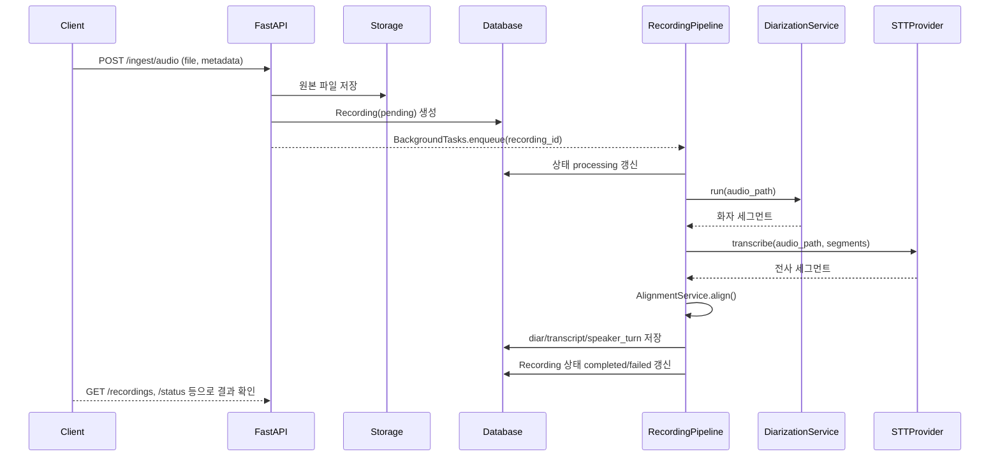

# 오디오 처리 아키텍처

## 목표

(주요 용어는 `docs/glossary.md` 참고)

- Siri/외부 마이크에서 수집한 음성을 원본 녹음과 메타데이터와 함께 저장한다.
- 화자 분리(Pyannote)와 음성 인식(STT)을 수행한다.
- 화자 분리 세그먼트와 전사 세그먼트를 정렬하여 구조화된 결과를 DB에 기록한다.
- STT 공급자(Whisper, Google 등)를 유연하게 교체할 수 있는 인터페이스를 유지한다.

## 상위 동작 흐름

1. 인입 API가 오디오(webm/wav)와 선택적 힌트(언어, 장치, 태그)를 수신한다.
2. API는 원본 파일을 워크 디렉터리에 저장하고 `Recording` 레코드를 `pending` 상태로 생성한다.
3. API는 `RecordingPipeline.run` 작업을 FastAPI BackgroundTasks에 등록한다(향후 Celery/RQ로 대체 예정).
4. 파이프라인이 오디오를 정규화(ffmpeg)하고 Pyannote 화자 분리를 실행해 세그먼트를 생성한다.
5. STT 프로바이더가 화자 세그먼트(또는 전체 오디오)에 대해 전사를 수행한다.
6. Alignment 서비스가 전사 세그먼트를 화자 세그먼트에 매핑한다.
7. 파이프라인이 결과를 DB에 저장하고 녹음 상태를 `completed` 또는 `failed`로 갱신한다.
8. `/recordings` API나 메타데이터 조회를 통해 결과를 확인한다.

## 시퀀스 다이어그램 (간단 뷰)



## 컴포넌트 개요

- **API 레이어(FastAPI)**
    - 라우트: `/ingest/audio`(POST, GET), `/ingest/audio/{id}/status`, `/ingest/audio/{id}/metadata`,
      `/ingest/test-client`, `/recordings`, `/recordings/{id}`, `/recordings/{id}/segments`,
      `/health`, `/health/db`.
    - 인증(추후), 입력 검증, 스토리지 전달, 작업 큐 등록을 담당한다.
    - `app.deps`를 통해 DB 세션과 서비스 인스턴스를 의존성 주입받는다.

- **Recording 서비스 (`app/services/recording.py`)**
    - 업로드 스트림을 받아 워크 디렉터리(`settings.WORK_DIR/recordings/<id>/`)에 저장한다.
    - 표준 파일명 `raw.<ext>`와 `metadata.json`을 생성하고 용량 제한을 검증한다.

- **Diarization / STT / Alignment 서비스**
    - STT 기본 구현은 faster-whisper 기반 `WhisperProvider`입니다. (Google STT는 스캐폴드 상태)
    - 화자 분리는 경량 `RuleBasedDiarizationService` 또는 Pyannote 기반 구현을 사용합니다.
    - 정렬은 `AlignmentService`가 담당하며, 향후 화자 임베딩/룰 기반 개선 여지가 있습니다.

- **작업 오케스트레이터 (`app/services/pipeline.py`)**
    - `RecordingPipeline`이 화자 분리 → STT → 정렬 → DB 저장을 수행한다.
    - 디바이스 선택, 길이 계산(ffprobe), 재시도 로직은 향후 확장 포인트로 남겨둔다.

- **Persistence (`app/db`)**
    - `Recording`, `DiarSegment`, `TranscriptSegment`, `SpeakerTurn` 테이블과 `crud.py` 헬퍼가 결과를 저장한다.
    - `/recordings` 및 `/ingest/audio/{id}/transcript` API가 저장된 데이터를 직접 확인할 수 있도록 한다.

- **스토리지 레이어**
    - 원본 오디오와 파이프라인 산출물(JSON)을 워크 디렉터리에 저장한다.
    - 향후 MinIO/S3 등 객체 스토리지로 추상화를 확장한다.

- **설정 & 의존성 관리**
    - `settings.py`가 환경 변수(DB, STT 제공자, 스토리지 경로, GPU 플래그 등)를 로드한다.
    - `deps.py`가 Recording/Diarization/STT/Alignment 서비스와 파이프라인을 싱글턴으로 주입한다.

- **관측 가능성 & 운영**
    - `app/logging.py` 확장을 통해 구조화 로그와 추적 ID를 남긴다.
    - `/ingest/audio/{id}/status`로 파이프라인 진행 상황을 즉시 확인할 수 있다.
    - 추후 Prometheus/OTel 메트릭을 연결한다.

## 시퀀스 상세 (텍스트)

```text
Client -> /ingest/audio (POST)
  -> RecordingService.store_upload()
  -> crud.create_recording(status=pending)
  -> BackgroundTasks.add(RecordingPipeline.run)

RecordingPipeline.run
  -> crud.update_recording_status(status=processing)
  -> DiarizationService.run()
  -> STTProvider.transcribe()
  -> AlignmentService.align()
  -> crud.replace_* 세그먼트 저장
  -> crud.update_recording_status(status=completed/failed)
```

## 프로바이더 추상화 & 마이그레이션

- `STTProvider` 인터페이스로 Whisper, Google 등 공급자를 쉽게 교체합니다.
- `TranscriptSegment` DTO는 `provider`, `start_ms`, `end_ms`, `text`, `confidence`, `language`,
  `speaker_label`을 공통 필드로 사용합니다.
- 기본값은 faster-whisper 기반 `WhisperProvider`이며 설치가 필요합니다.
- Google STT 스트리밍 결과를 DTO 세그먼트로 변환하는 어댑터가 필요합니다.
- 동일한 샘플 오디오로 여러 프로바이더 결과를 비교하는 계약/통합 테스트를 유지합니다.

## 테스트 전략

- 합성 세그먼트를 활용한 Alignment 단위 테스트.
- 소형 녹음 파일을 활용한 STT 프로바이더 계약 테스트.
- `/ingest/audio` 통합 테스트에서 스토리지/파이프라인을 목킹해 상태 전이를 검증.
- 엔드투엔드 테스트로 실제 업로드 후 `/recordings/{id}`, `/segments`를 확인.

## 다음 구현 단계

1. Pyannote/Whisper 실제 inference를 연결하고 ffprobe 기반 길이 계산, GPU/CPU 설정을 추가한다.
2. Celery/RQ 등 외부 작업 큐를 도입해 파이프라인을 분리하고 재시도·모니터링을 강화한다.
3. MinIO/S3 추상화를 추가해 오디오와 산출물을 객체 스토리지로 이전할 수 있도록 한다.
4. GPT 연동용 `ConversationService`와 `POST /recordings/{id}/ask` 흐름을 설계하고 LLM 응답을 저장한다.
5. 구조화 로그, OpenTelemetry 트레이싱, Prometheus 메트릭으로 관측 가능성을 확장한다.
